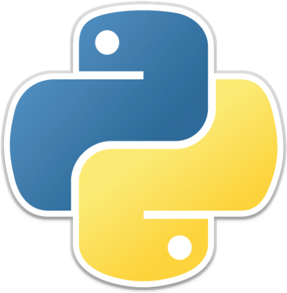

# Python Bootcamp 2020

[![Contributors][contributors-shield]][contributors-url]
[![Forks][forks-shield]][forks-url]
[![Stargazers][stars-shield]][stars-url]
[![Issues][issues-shield]][issues-url]
[![GPLv3 License][license-shield]][license-url]
[![LinkedIn][linkedin-shield]][linkedin-url]

> Um curso completo de programação em Python

> Keywords: `python`, `pandas`, `numpy`, `anaconda`, `bootcamp`

<!-- TABLE OF CONTENTS -->
## Conteúdo

* [Sobre o Projeto](#sobre-o-projeto)
* [Listagem de Aulas](#listagem-de-aulas)
* [Contato](#contato)
* [Licença](#licença)
* [Referências](#referências)

## Sobre o Projeto

Com intuito de melhorar meu conhecimento sobre Python, resolvi iniciar uma série de vídeos no meu canal no Youtube. Ensinando como programar em Python desde o zero!

## Listagem de Aulas

Lista de Aulas.

* <strong>Aula 01</strong>: História da linguagem Python, Versões, Cenário atual, Como preparar um Ambiente para programar em Python, Interpretadores Online, Plataforma Anaconda, The Zen of Python.
* <strong>Aula 02</strong>: Básico da Linguagem, Keywords, Identificadores, Variáveis, Estrutura de um Programa, Formato de Arquivo, Codificação, Identação, Importação de Módulos, Comentários, Execução.
* <strong>Aula 03</strong>: Operadores (Aritméticos, Bitwise, Lógicos, Relacionais), Binding, Função type(), Tipos Numéricos (int, float, complex), Booleanos, Módulo Decimal, Módulo Fractions, Sistemas de Numeração (binário, octal e hexadecimal), Operador is, Short-Circuits, Casting. 

<!-- Markdown link & img dfn's -->
[wiki]: https://github.com/devcated/curso_python3/wiki
[linkedin-shield]: https://img.shields.io/badge/-LinkedIn-black.svg?style=flat-square&logo=linkedin&colorB=555
[linkedin-url]: https://linkedin.com/in/marcosmapl
[contributors-shield]: https://img.shields.io/github/contributors/devcated/curso_python3.svg?style=flat-square
[contributors-url]: https://github.com/devcated/curso_python3/graphs/contributors
[forks-shield]: https://img.shields.io/github/forks/devcated/curso_python3.svg?style=flat-square
[forks-url]: https://github.com/devcated/curso_python3/network/members
[stars-shield]: https://img.shields.io/github/stars/devcated/curso_python3.svg?style=flat-square
[stars-url]: https://github.com/devcated/curso_python3/stargazers
[issues-shield]: https://img.shields.io/github/issues/devcated/curso_python3.svg?style=flat-square
[issues-url]: https://github.com/devcated/curso_python3/issues
[license-shield]: https://img.shields.io/github/license/devcated/curso_python3.svg?style=flat-square
[license-url]: https://raw.githubusercontent.com/devcated/curso_python3/master/LICENSE
[think-python]: https://www.safaribooksonline.com/library/cover/9781449332006/250w/
[think-python-url]: https://www.oreilly.com/library/view/think-python/9781449332006/

## Contato

Marcos Lima  – marcos.lima@icomp.ufam.edu.br

[![LinkedIn][linkedin-shield]][linkedin-url]

[Acesse ao projeto no GitHub](https://github.com/devcated/curso_python3/)

## Licença

- **[GNU General Public License v3.0 license](https://opensource.org/licenses/GPL-3.0)**	
- Copyright 2020 © <a href="https://www.linkedin.com/in/marcosmapl" target="_blank">marcosmapl</a>.

<!-- ACKNOWLEDGEMENTS -->
## Referências
* Think Python First Edition, by Allen B. Downey

[![Think Python][think-python]][think-python-url]
